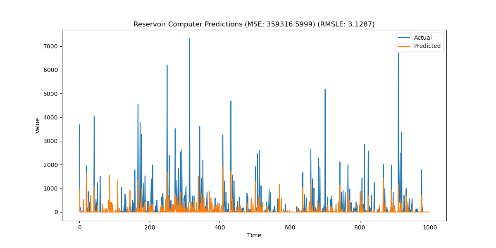

# Reservoir Computing for Time Series Prediction

This project implements a Reservoir Computer for time series prediction using Python. The implementation includes training and prediction functionalities, and it visualizes the prediction results against actual values.

## Purpose
The purpose of this project was to expand my knowledge in reservoir computing implementations in python, as well as provide a base model for which to compare improvements to the basic reservoir computer structure.

## Project Structure

- `models/reservoir_computer.py`: Contains the `ReservoirComputer` class which implements the reservoir computing model.
- `train.py`: Contains functions to train the reservoir computer and evaluate its performance.
- `main.py`: The main script to load data, train the model, and visualize the results.

The rest of the files can be found in the directory:
```sh
reservoir-computing
└── app.py
├── data
│   ├── air_quality
│   │   └── AirQualityUCI.csv
│   │   └── AirQualityUCI.xlsx
│   ├── store-sales
│   │   └── holidays_events.csv
│   │   └── oil.csv
│   │   ├── processed
│   │   ├── raw
│   │   └── sample_submission.csv
│   │   └── stores.csv
│   │   └── test.csv
│   │   └── train.csv
│   │   └── transactions.csv
└── main.py
├── models
│   └── multi_rc.py
│   └── reservoir_computer.py
├── output
│   └── aq_predictions.png
│   └── sales_predictions.png
└── readme.md
└── requirements.txt
├── src
│   ├── reservoir_computing
│   │   └── load_aq_data.py
│   │   └── load_ts_data.py
└── train.py
```

## Installation

1. Clone the repository:
    ```sh
    git clone https://github.com/LucasG2008/reservoir-computing.git
    cd reservoir-computing
    ```

2. Install the required packages:
    ```sh
    pip install -r requirements.txt
    ```

## Data

There are two datasets ready with preprocessing for time-series analysis:

1. Air Quality dataset from UCI Machine Learning Repository

    * More information about the datset can be found at the following [link](https://archive.ics.uci.edu/dataset/360/air+quality)

    * Citation: Vito, S. (2008). Air Quality [Dataset]. UCI Machine Learning Repository. https://doi.org/10.24432/C59K5F.

2. Store Sales - Time Series Forecasting from Kaggle

    * Dataset overview can be found at the following [link](https://www.kaggle.com/competitions/store-sales-time-series-forecasting/data)

## Usage

1. Select the data to be loaded in the `main.py` file. Otherwise, prepare custom data in the same format by adding a preprocessor to the `src/reservoir_computing` folder

2. Adjust hyperparameters in main.py
    ```python
    rc_params = {
        'input_dim': input_dim,
        'reservoir_size': 500,
        'reservoir_ridge_alpha': 1e-6,
        'reservoir_output_dim': 1,
    }
    ```

2. Run the main script:
    ```sh
    python main.py
    ```

3. The script will output the Mean Squared Error (MSE) and Root Mean Squared Log Error (RMSLE) of the predictions. It will also save a plot of the predictions vs actual values in the `output` folder.

## Dashboard Visualization

The dashboard was created to allow for simple parameter tuning and creating of custom reservoir computer models. It is currently limited to 
the air quality dataset.

Run the dashboard:
```sh
streamlit run app.py
```


## Results

The following image shows the comparison between the predicted values and the actual values:

Air Quality dataset (link):


Store Sales dataset (link):


## Code Overview

### ReservoirComputer Class

The `ReservoirComputer` class is defined in `models/reservoir_computer.py`. It includes methods to initialize the reservoir, update its state, train the model, and make predictions.

### MultiReservoirComputer Class

The `MultiReservoirComputer` class is defined in `models/multi_rc.py`. It creates an ensemble model of various `ReservoirComputer` models and takes the average of the predictions. Defenitly a lot of room for improvement in implementing different ensembling techniques.

### Training and Evaluation

The `train_reservoir_computer` function in `train.py` handles the training and evaluation of the reservoir computer. It also includes functionality to save the prediction results as a plot.

### Main Script

The `main.py` script loads the data, initializes the reservoir computer with specified parameters, trains the model, and visualizes the results.

## License

Feel free to use any of the code in this repository, just include attribution.

## Libraries

- [scikit-learn](https://scikit-learn.org/)
- [NumPy](https://numpy.org/)
- [Matplotlib](https://matplotlib.org/)
- [tqdm](https://tqdm.github.io/)